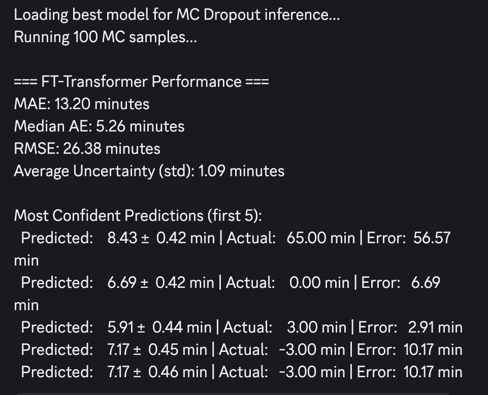
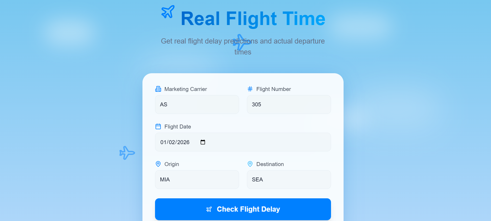
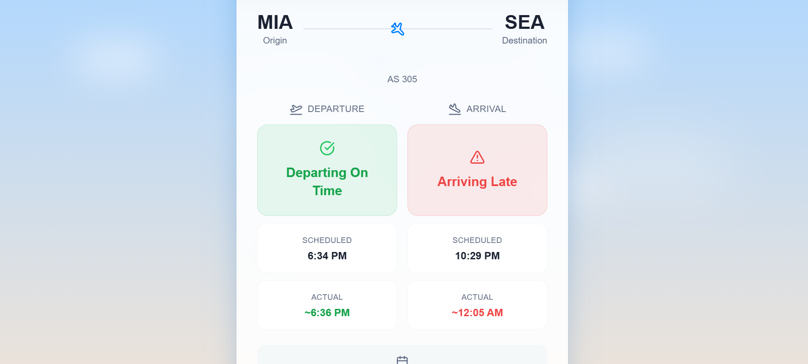
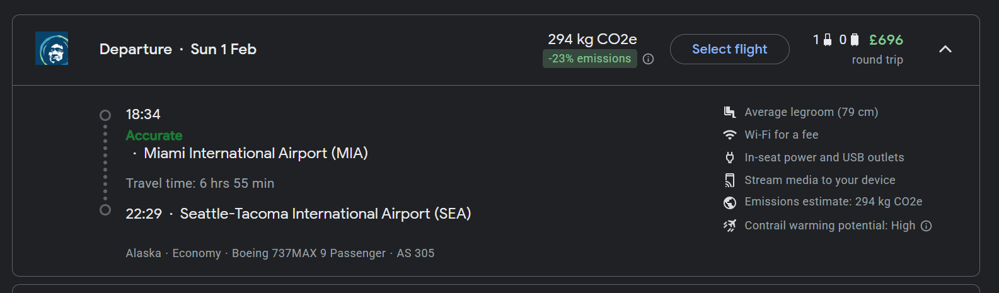

# Planehack: To predict flight departure and arrival delays

> This application is inspired from
>
> *Lin Xu  et al. (2025) Aeolus: A Multi-structural Flight Delay Dataset*
>
> [arXiv:2510.26616](<https://arxiv.org/abs/2510.26616#:~:text=(or-,arXiv%3A2510.26616v2,-%5Bcs.LG%5D>); [Github Repo](https://github.com/Flnny/Delay-data.git)
>
> And was developed at **ichack2026** (Jan 31st - Feb 1st)


This is an web application and a web browser extension that uses **FT-Transformers** to predict delays in the departure and arrival of the planes. For the details on how this application was developed, take a look at the [devpost](https://devpost.com/software/planehack).

> [!IMPORTANT]
> Currently, this application supports and predicts only airplanes & airports within the United States of America.

## The Tech Stack

* Frontend
    1.  React: For the UI logic.

    2.  Vite: Because waiting for Webpack to bundle is so 2018.

    3.  Axios: To talk to our Flask API.

    4.  Tailwind CSS (Optional): For styling (remove if not using).

* Backend
    1.  Python 3.13

    2.  Flask

    3.  PyTorch / Scikit-Learn

    4.  Pandas / numpy

The application also uses API from [Aviation Stack](https://aviationstack.com/login) to get flight details and information real-time.

## Getting started

If you are interested in a **web browser** extenstion, go to [here](#web-browser-extension).

For the application to be locally deployed, first clone the repo.

``` 
git clone https://github.com/xm22677/planehack.git 
```
### 1. Backend 

```python
# Navigate to the backend folder
cd backend

# Create a virtual environment (Recommended)
python -m venv venv
```
<details>
<summary> On Windows </summary>

```python
venv\Scripts\activate
```

</details>

<details>
<summary> On Mac/Linux </summary>

```python
source venv/bin/activate
```
</details>

```python
# Install the dependencies (Flask, PyTorch, Pandas, etc.)
pip install -r requirements.txt

# Start the Flask Server
python app.py
```

*The backend API typically runs on `http://127.0.0.1:5000`*

### 2. Frontend

> [!NOTE]
> You need `npm` to start the frontend. Check the official [docs](https://docs.npmjs.com/getting-started) to install in your system.

```bash
# Open a new terminal and navigate to the frontend folder
cd frontend

# Install the node modules
npm install

# Run the development server
npm run dev
```
*Vite runs the application to view it on `http://localhost:8080`*

## Training & Prediction

> [!NOTE]
> The [Aeolus](https://www.kaggle.com/datasets/flnny123/mfddmulti-modal-flight-delay-dataset) dataset is used for the model training.

**1. Preprocessing** - 

Handling missing values, `datetime` strings and encoding the categorical values like `Airline Carrier`.

**2. Models** - 

> [!NOTE]
> Take a look at the [devpost](https://devpost.com/software/planehack) for the entire list of models trained and analysed

`FT Transformer` (Feature Tokenizer Transformer) is trained on the dataset and used for the predictions.

**3. Training** -

The model learns weights for features like *Flight No.*, *Origin*, *Destination*, *Weather*, etc.

**4. Inference** -

Trained model is exported along with the data pipelines and the outputs are inverse-scaled back to minutes.

## Configuration
If you have a GPU and want to run inference on **CUDA**, ensure your environment variables are set. By default, the app checks for `torch.cuda.is_available()` and falls back to **CPU** if needed.

**Environment Variables**: Create a .env file in the backend to store the `Aviation stack` API key.

## Screenshots

### Evaluation Metrics:



### 1. Website -




### 2. Web Browser Extenstion -


## Challenges

* **Data Collection** - 
    
    Finding an open source dataset that provided the features that we needed was challenging as most of the APIs and datasets were behind paywall. We had to go through research papers for datasets, where we were able to find, [Aeolus](https://www.kaggle.com/datasets/flnny123/mfddmulti-modal-flight-delay-dataset).

* **Model Evaluations** -

    We experimented and evaluated multiple Machine learning models from Linear Regression to XG-Boost across multiple iterations. We had able to achieve a good MAE via `FT Transformers`.

* **Hardware Constraints** - 

    Since we needed to train a lot of models from traditional to Neural Networks, we needed a powerfull GPU and CPU. Getting to run those models in a limited hardware by using techniques like batch processing was exciting.

* **Making best use of avaialble open source tools** -

    All of the tools and packages used in this application is open-source and finding the best for niche needs of the application, for eg. weather at the airport during the departure/arrival time, APIs for fetching flight details, made this as one of the hardest challenges.


## Web Browser Extension

Follow the steps below to get the chrome web browser extension

### Steps

1. Boot chrome without security to bypass CORS

2. Go to chrome extensions and enable developer mode

3. Load unpacked extension with the chromeextension directory

4. Delay info will be injected onto google flights for US flights


## License

Distributed under the MIT License. See [LICENSE](LICENSE) for more information.